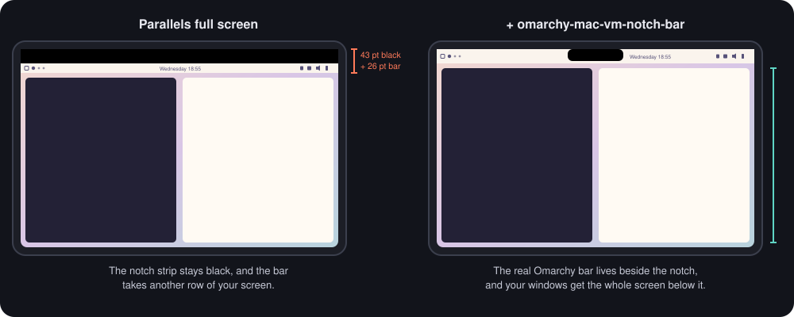

<h1 align="center">omarchy-mac-vm-notch-bar</h1>

<p align="center"><b>The Omarchy bar around the notch, for Omarchy in Apple Silicon VMs.<br>Right where Parallels leaves a black hole.</b></p>

<p align="center">
  
</p>

You run [Omarchy](https://omarchy.org) full screen in a Parallels VM on a
MacBook with a notch. It is fast, it is beautiful, and it has a black bar
across the top that nobody asked for. This project puts Omarchy's **real** bar
into that black strip — not a look-alike, the actual Quickshell bar, pixels and
all — and gives the space the bar used to take back to your windows.

> [!NOTE]
> **Got an M1 or M2 Mac?** Run Omarchy natively on [Asahi Linux](https://asahilinux.org)
> instead — no VM, full hardware, and it uses the notch area itself. This project
> is for **M3 and M4** Macs, which Asahi does not support yet, so a VM is the way
> to run Omarchy there. (It works on M1 and M2 too.)

<p align="center">
  
</p>

## The black strip (and why nobody can fix it)

On a notched MacBook, Parallels puts its full-screen window *below* the camera
housing. The 43 points beside the notch stay black, and Omarchy then draws its
own 26-point bar underneath. About 69 points of your screen, gone.

Can't we just make the VM use that area?

- **Parallels:** there is no setting, documented or hidden. Parallels staff
  [said so on their forum](https://forum.parallels.com/threads/2021-16-macbook-fullscreen-over-notch.355917/):
  drawing into the notch area would go against Apple's guidelines.
- **macOS:** only the app that owns a window may place it next to the notch.
  Moving Parallels' window there from the outside is simply refused (tried it,
  also with the menu bar on auto-hide).
- **Code injection** into Parallels would work in theory, but needs System
  Integrity Protection turned off. No thanks.

So the VM cannot go up there. **But a tiny Mac app of our own can** — and it can
show whatever the VM would have shown.

## How the trick works

1. **An invisible monitor.** Inside the VM, Hyprland gets an extra, headless
   output called `NOTCH`: exactly as wide as your screen, exactly as tall as the
   bar. Nobody ever sees it. It sits *on top of* the real display's top edge,
   which sounds wrong but is the whole point — Parallels maps its mouse over the
   bounding box of all monitors, so an extra monitor anywhere else would shift
   every click.
2. **The bar, twice.** Omarchy's bar is cloned with Omarchy's own
   `omarchy plugin clone` and patched: one copy renders on `NOTCH` (the pixels
   you will see), the copy on the real display shrinks to 1 px and hides just
   off screen. It is not gone, though — your clicks are pressed on that hidden
   copy, so Omarchy opens its panels (clock, audio, network, …) on the visible
   display, right below the notch.
3. **Streaming only what changes.** `notchcast`, a small C program in the VM,
   captures `NOTCH` with Wayland's `ext-image-copy-capture`. A capture only
   completes when Hyprland actually repaints, so an idle bar costs zero CPU. It
   sends just the rectangle that changed, LZ4-compressed — usually 0.5–3 KB —
   over Parallels' private network.
4. **A panel above everything.** *Omarchy Notch Bar.app* draws the frames in a
   borderless panel at window level 27 — above the menu bar (24) and above an
   invisible window Parallels keeps over the strip (26). It never takes focus,
   so your keyboard stays with the VM. It lives on the VM's full-screen Space
   and slides with it when you swipe.
5. **Cursor juggling.** Over the strip, the Mac shows the *guest's* cursor
   images (sent over from the VM) while the VM hides its own; over the VM, the
   macOS cursor is hidden for real. One cursor at a time.
6. **Fail-safe.** The Mac app says "keep the bar parked" every second. If it
   stops, crashes or you leave full screen, the VM brings its bar back within
   five seconds.

## Requirements

<sub>Why Parallels and not UTM? [Some numbers](docs/why-parallels.md).</sub>

- A MacBook with a notch, macOS 14 or later, Xcode Command Line Tools
- Parallels Desktop running Omarchy (Arch Linux ARM, Hyprland 0.56 or newer)
  full screen on the built-in display, with Parallels' shared network
- In the VM: `gcc`, `wayland`, `wayland-protocols`, `lz4`, `python3` — all
  already there on Omarchy

## Install

In the VM, as your normal user, from a checkout of this repository:

```bash
./guest/install.sh
```

On the Mac:

```bash
./mac/install.sh
```

That builds `~/Applications/Omarchy Notch Bar.app` and starts it at login
(log: `~/Library/Logs/notchbar.log`). Put the VM in full screen on the built-in
display and the bar moves into the strip.

## Uninstall

```bash
./guest/uninstall.sh      # in the VM (add --remove-bar-clone to drop the bar clone too)
./mac/uninstall.sh        # on the Mac
```

## Configuration

Mac app — `defaults write ch.gillesgoetsch.notchbar <key> <value>`, then
`launchctl kickstart -k gui/$(id -u)/ch.gillesgoetsch.notchbar`:

| Key | Default | |
|---|---|---|
| `listenHost` | `10.211.55.2` | Mac side of the Parallels shared network |
| `port` | `47811` | |
| `guestPrefix` | `10.211.55.` | only guests from this network are accepted |
| `vmOwner` | `Parallels Desktop` | owner of the VM's full-screen window |

VM — `systemctl --user edit notchcast`, `Environment=…`:

| Variable | Default | |
|---|---|---|
| `NOTCHBAR_HOST` / `NOTCHBAR_PORT` | `10.211.55.2` / `47811` | where the Mac app listens |
| `NOTCHBAR_OUTPUT` | `NOTCH` | name of the invisible monitor |
| `NOTCHBAR_SCREEN` | `Virtual-1` | the built-in display's output |

## Good to know

- Hover effects (tooltips, hover highlights) are not mirrored; clicks, right
  and middle clicks and scrolling are. Tray icons show up but can't be clicked
  in the strip.
- The bar clone is a fork of Omarchy's bar. After an Omarchy update that
  changes the bar, re-clone and run `./guest/install.sh` again — the patch is
  versioned and refuses to apply blindly.
- Hyprland warns about overlapping monitors after layout changes. The overlap
  is deliberate; `notchbar.lua` dismisses that one warning and nothing else.
- Cursor handling uses the window-server property `SetsCursorInBackground`,
  which is not public API (but widely used and stable for years).
- At the exact moment the pointer crosses into the strip you may catch a
  ghost of the VM cursor for a frame or two: the VM draws its own cursor and
  the display pipeline has a little latency.

## Tip: a macOS-style clock

With the bar in the menu-bar spot, a macOS-like clock at the far right feels
natural. In `~/.config/omarchy/shell.json`, move the `omarchy.clock` entry to
the end of `bar.layout.right`, give it `"format": "ddd MMM d HH:mm"`
(→ `Wed Sep 30 19:20`) and set `"centerAnchor": ""`. The shell picks the change
up by itself.

## Troubleshooting

| Symptom | Look at |
|---|---|
| Strip stays black | `~/Library/Logs/notchbar.log` ("guest connected"?) · in the VM: `systemctl --user status notchcast` |
| Bar in the VM *and* in the strip | `omarchy-shell notchbar state` → `parked` should be `true` |
| Mouse lands in the wrong place | `hyprctl monitors` → `NOTCH` must sit at the built-in display's position and width |
| Panels open on the wrong screen | `NOTCHBAR_SCREEN` must name the built-in display |

## Porting to UTM

Nothing here is Parallels-specific at heart: the VM side only needs Hyprland
and a network path to the Mac, and the Mac side only needs to recognise the
VM's full-screen window. A UTM setup would mostly need `vmOwner` set to UTM's
window owner and the host address of UTM's shared network
(`192.168.64.1`). UTM 5.0.6 on macOS 27 can already draw into the notch area
by itself — for older macOS versions this project could do the job. Pull
requests welcome.

## Credits

- [Omarchy](https://omarchy.org) by DHH and contributors — the bar, the
  shell, the whole beautiful thing
- [Hyprland](https://hyprland.org) and [Quickshell](https://quickshell.org)
- Not affiliated with Omarchy, Parallels or Apple. Omarchy's bar code is not
  included here: it is cloned from your own Omarchy installation and patched
  at install time.

## License

MIT — see [LICENSE](LICENSE).
