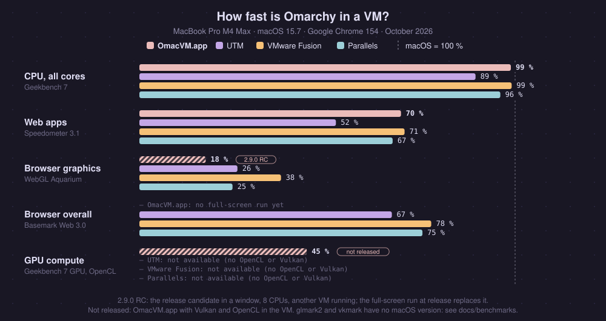

<h1 align="center">OmacVM</h1>

<h3 align="center">Omarchy in a VM on your Mac, feeling native</h3>

<p align="center">One command builds the VM, in Parallels Desktop, UTM or VMware Fusion. Then your Mac's Wi-Fi, Bluetooth, sound, keys, trackpad, displays, Night Shift and wallpaper all work in Omarchy.</p>

<p align="center">
  <b>With <a href="src/omanotch/README.md">Omanotch</a></b>: Omarchy's real bar beside the MacBook's notch, where the VM leaves a black strip.
</p>

<p align="center">
  
</p>

You run [Omarchy](https://omarchy.org) on an Apple Silicon Mac, in a VM. It is
fast, but out of the box it feels like a guest:

- **Full screen wastes the notch.** The VM sits below the camera housing and
  leaves a black strip across the top of your MacBook's screen.
- **The trackpad doesn't swipe.** Three- and four-finger swipes and pinch go to
  macOS's Mission Control and Spaces, never to Omarchy's workspaces.
- **Scrolling doesn't feel like a Mac.** The VM app turns your trackpad into a
  wheel; macOS's acceleration and momentum get lost on the way.
- **The bar shows a virtual network card**, not your Wi-Fi, no Bluetooth at
  all, and none of the Mac's audio devices.
- **The Mac's keys aren't Omarchy's.** Volume and brightness open macOS's
  popups, Cmd+Space opens Spotlight, and Parallels turns Cmd+C/V into Ctrl.
- **External displays ignore your macOS arrangement.**

**OmacVM** fixes all of that and builds the VM for you: Arch Linux ARM,
[omarchy-mac](https://github.com/omacom/omarchy-mac) and the glue on both sides
of the VM, with [Omanotch](src/omanotch/README.md) putting
Omarchy's bar beside the notch.

> [!NOTE]
> **Got an M1 or M2 Mac?** You can run Omarchy natively on
> [Asahi Linux](https://asahilinux.org) instead. OmacVM is for **M3, M4 and
> newer** Macs, which Asahi does not support yet (and for anyone who wants macOS
> and Omarchy side by side).

> [!IMPORTANT]
> **A full Omarchy, not a demo.** OmacVM installs
> [omarchy-mac](https://github.com/omacom/omarchy-mac), the Arch Linux ARM port
> of Omarchy, onto the VM's own disk: the real system, with your user, `omarchy
> update` and everything Omarchy ships. It uses omarchy-mac's **release
> candidate** (`rc`) packages for now, and its `stable` lane automatically once
> omarchy-mac publishes one.
> [try-omarchy](https://github.com/omacom/try-omarchy) is something else: a
> pinned, try-it-out image. OmacVM only boots it once, as the temporary
> installer that puts Arch Linux ARM onto the disk, and then removes it.

## Get started

```bash
curl -fsSL https://raw.githubusercontent.com/gillesgoetsch/omacvm/main/install.sh | bash
```

This puts OmacVM in `~/.omacvm`, adds the `omacvm` command and starts it. Run
`omacvm` any time after that: with no VM yet it builds one; otherwise it asks
what you want to do (build another VM, switch features, update, check).

Prefer git? `git clone https://github.com/gillesgoetsch/omacvm && cd omacvm && ./install.sh`
(or just `./omacvm`).

Or let your coding agent (Claude Code, Codex, …) do it, with this prompt:

```text
Set up OmacVM on my Mac (github.com/gillesgoetsch/omacvm): Omarchy in a VM.
Read https://raw.githubusercontent.com/gillesgoetsch/omacvm/main/AGENTS.md
first (section 0) and follow it. Install it with
curl -fsSL https://raw.githubusercontent.com/gillesgoetsch/omacvm/main/install.sh | bash -s -- --no-start
then walk me through the build: ask me Parallels, UTM or VMware Fusion, how much of my Mac
the VM gets and which features I want (explain each, scroll momentum is
experimental), show me the plan, ask for my password, build it, and tell me
the steps only I can do.
```

More in [With a coding agent](#with-a-coding-agent).

<p align="center">
  
</p>

## What you get

| Feature | What it does |
|---|---|
| **The bar beside the notch** | With [Omanotch](src/omanotch/README.md), Omarchy's real bar moves into the black strip beside the MacBook's notch, and your windows get the full height of the screen. The bar is as tall as macOS's menu bar, or exactly as tall as the notch (`defaults write ch.gillesgoetsch.omanotch flush -bool true`). OmacVM.app does it on its own |
| **Trackpad gestures** | Three- and four-finger swipes switch workspaces and pinch zooms while the VM is full screen; macOS's own Spaces swipe is off meanwhile. ⌃⌥⌘Esc hands the trackpad back to macOS. The MacBook's trackpad, or a Magic Trackpad on a Mac mini, iMac or Studio |
| **macOS-native scroll momentum** *(experimental, but awesome)* | Two-finger scrolling in every direction with your Mac's own acceleration and momentum, pinch included. Off unless you choose it ([how it works](#macos-native-scroll-momentum)) |
| **The Mac's Wi-Fi in the bar** | Real network name and signal, nearby networks, and Omarchy's QR card to share the password (macOS asks you first). Joining a network and switching Wi-Fi stay on the Mac for now |
| **The Mac's Bluetooth in the bar** | Omarchy's own Bluetooth panel for the Mac's devices: connect and disconnect them, battery levels (AirPods left, right and case), Bluetooth on and off, forget a device. Pairing a new one opens the Mac's Bluetooth settings |
| **The Mac's audio in the bar** | Volume, mute, microphone, switching outputs (AirPods show up when they connect), with Omarchy's input meter |
| **The Mac's camera** | Linux apps and video calls in the browser see the Mac's camera as *Mac Camera*. It is on, green light included, only while one of them uses it. Parallels passes the camera itself; on UTM, VMware Fusion and OmacVM.app OmacVM brings it ([how](#how-it-works)). On UTM and Fusion it comes through OmacVM Bridge, which is then installed even with the Bridge turned off |
| **Media keys, Omarchy's popup** | Volume, mute and brightness keys drive the Mac and Omarchy shows its own on-screen display instead of macOS's. Shift with the brightness keys sets the Mac's keyboard light, with three dimmer steps below macOS's lowest, Option takes small steps, as in Omarchy |
| **Displays that follow the Mac** | Native Retina resolution and 120 Hz ProMotion. On Parallels and VMware Fusion also every external display, in exactly the arrangement you set in macOS, with Omarchy's scaling menu kept |
| **The GPU, in the desktop and the browsers** | Hyprland's animations, and pages and WebGL in Chromium, Chrome, Brave and Firefox, drawn by the Mac's GPU on every route (OmacVM fixes what each app gets wrong: [UTM](docs/troubleshooting.md#14-utm-chrome-has-no-gpu-then-webgl-comes-out-empty), [Fusion](docs/troubleshooting.md#2-fusion-browsers-draw-everything-in-software)) |
| **Per-display workspaces** | Each display has its own workspaces 1…0, like Spaces. Unplug and they park on the Mac's screen; plug back in and they return |
| **Clipboard both ways, Cmd+V** | Copy in Omarchy, paste on the Mac and back; Cmd+V pastes everywhere, terminals included |
| **Night Shift and True Tone** | The Mac's Night Shift in Omarchy's bar, with Omarchy's own night light icon, lit while it is on. A click opens a panel like Omarchy's own: Night Shift, its strength and True Tone, all on the Mac (Super+Ctrl+N switches Night Shift directly). It replaces Omarchy's own night light, so the screen is never tinted twice |
| **Wallpaper follows the theme** | Switch Omarchy's theme or background and the Mac's desktop wallpaper follows, on every Space (macOS also shows it behind its own lock screen) |
| **The Mac's clock** | Omarchy's clock at the far right of the bar, in your Mac's menu bar format (day, date, 12 or 24 hours, seconds, language) |
| **The Mac's battery** | On a MacBook, Omarchy's battery icon and panel show the Mac's charge and charging, as on a laptop, plus time left and Omarchy's low-battery warning (not tested yet with the Mac on battery; the VM never suspends for it). Parallels does this itself; OmacVM adds it on UTM, VMware Fusion and OmacVM.app |
| **Your keyboard layout** | Taken from the Mac |
| **Fast** | Near-native speed on Parallels; memory tuning so the VM does not hoard the Mac's RAM; btrfs snapshots you can boot from GRUB; optionally a memory-optimized kernel (transparent huge pages, MGLRU) |

<p align="center">
  
</p>

<p align="center">
  
</p>

## Four ways: Parallels, UTM, VMware Fusion or OmacVM.app

OmacVM builds the same Omarchy VM in Parallels Desktop, UTM, VMware Fusion or
OmacVM.app, its own app that needs nothing else. Get the app with
`omacvm build --vm-type app` (it downloads the app when it is missing), or
download `OmacVM-<version>.zip` from the
[releases](https://github.com/gillesgoetsch/omacvm/releases). Downloaded with a
browser, macOS blocks it the first time: click Open Anyway in System Settings ›
Privacy & Security. The app builds the VM with its own steps, then OmacVM is
applied as on the other routes ([docs/routes/app.md](docs/routes/app.md)).
Everything in [What you get](#what-you-get) works in all four apps, except
where the table says otherwise.

**Which one?** Fastest and least to set up, and fine with paying: Parallels.
Free, with external displays and the longest battery life: VMware Fusion.
Free and open source, one display: UTM.

| | Parallels Desktop | UTM 5 | VMware Fusion 26 | OmacVM.app |
|---|---|---|---|---|
| **Best for** | least to set up | free and open source | free, external displays, battery | nothing else to install |
| Cost | paid | **free**, open source | **free**, also for work | **free**, open source |
| CPUs and memory per VM | Standard: 4 CPUs, 8 GB<br>Pro or trial: more | **no cap** | **no cap** | **no cap** |
| **Speed** (the Mac itself = 100 %) | | | | |
| CPU, all cores: Geekbench 7 | 96 % | 89 % | **99 %** | **99 %** |
| CPU, one core: Geekbench 7 | **97 %** | 90 % | 93 % | **97 %** |
| Web apps: Speedometer 3.1 | 67 % | 52 % | **71 %** | 70 % |
| Animations in the browser: MotionMark 1.3.1 | no stable result | no stable result | **40 %** | no stable result |
| 3D: glmark2 (score) | **7306** | 964 | 1813 | 1017 |
| **Graphics and video** | | | | |
| GPU path | virgl | virgl | vmwgfx, with a Hyprland fix OmacVM builds | virgl |
| GPU in Chrome, Chromium, Brave, Firefox | ✓ | ✓ | ✓ | ✓ |
| YouTube 4K at 60 fps | ✓ decoded by the CPU | ✓ decoded by the CPU | ✓ decoded by the CPU | ✓ decoded by the CPU |
| GPU compute (Vulkan, OpenCL) | ✗ | ✗ | ✗ | ✗ |
| **Battery** (power draw, and hours on a full 100 Wh battery) | | | | |
| Idle desktop | 5.7 W · 18 h | being re-measured | **5.5 W · 18 h** | 6.2 W · 16 h |
| Reading, scrolling a page | 7.3 W · 14 h | being re-measured | **5.9 W · 17 h** | 6.8 W · 15 h |
| YouTube 4K | 24.2 W · 4.1 h | 39.2 W · 2.6 h | **20.4 W · 4.9 h** | 21.3 W · 4.7 h |
| Every CPU core busy | 72 W · 1.4 h | 61 W · 1.6 h | 74 W · 1.4 h | 71 W · 1.4 h |
| **Displays** | | | | |
| External displays | **✓ every one, in your macOS arrangement** | ✗ one display | **✓ every one, in your macOS arrangement** | not yet |
| Native Retina, 120 Hz | ✓ | ✓ | ✓ | ✓ |
| Resolution changes | **live** | fixed at boot | **live** | **live** |
| **Mac integration** | | | | |
| Wi-Fi, Bluetooth, audio, Night Shift, True Tone, wallpaper (OmacVM Bridge) | ✓ | ✓ | ✓ | coming |
| Media keys, trackpad gestures, Cmd shortcuts | ✓ | ✓ | ✓ | coming |
| The bar beside the notch | ✓ Omanotch | ✓ Omanotch | ✓ Omanotch | ✓ built in |
| Copy and paste | ✓ | ✓ | ✓ when the pointer crosses the VM's edge | ✓ |
| The Mac's battery in the bar | ✓ Parallels' own | ✓ through OmacVM Bridge | ✓ through OmacVM Bridge | ✓ built in |
| The Mac's camera | ✓ Parallels' own | ✓ through OmacVM Bridge (installed for it also with the Bridge off) | ✓ through OmacVM Bridge (likewise) | ✓ built in |
| Sound and the Mac's microphone | ✓, the microphone once macOS allows Parallels it | ✓ | ✓, the microphone once macOS allows Fusion it | ✓, the microphone once macOS allows OmacVM it |
| **Setup** | | | | |
| Get it | buy it or start the trial | `brew install --cask utm@beta` | download after a Broadcom sign-in | `omacvm build --vm-type app`, or the zip from the releases |
| Before first use | one Parallels setting | start UTM from the Dock | allow Accessibility for Fusion | allow Accessibility for OmacVM |
| Where the VM goes | **any folder, external drives too** | UTM's own library | **any folder, external drives too** | **any folder, external drives too** |

<p align="center">
  
</p>

On the Mac itself, for the same loads: idle 6.1 W (16 h), reading 6.6 W
(15 h), YouTube 4K 8.0 W (12.5 h, in hardware), every core busy 75 W (1.3 h).
The difference for video is decoding: macOS decodes YouTube's 4K in hardware,
and none of these apps gives Linux hardware video decoding.

How we measured: a MacBook Pro 16" M4 Max (macOS 15.7, 100 Wh battery), 16
CPUs and 48 GB per VM, one VM at a time in full screen on the built-in
display, nothing else open, brightness at 50 %, Google Chrome 154 on the Mac
and in each VM, OmacVM 2.3.0. Speedometer is the median of 3 runs, the rest
single runs. Power is the whole Mac's draw from its battery telemetry, 3
minutes per load; hours are 100 Wh over that draw, whole hours from 13 h up,
one decimal below. Every step, so you can repeat it: [docs/benchmarks](docs/benchmarks/README.md).

- **UTM's idle and reading numbers** are being measured again. Our run gave
  15 W at idle, but a later check showed about 5 W, so something was probably
  still busy in the VM during our run
  ([#32](https://github.com/gillesgoetsch/omacvm/issues/32)).
- **MotionMark** needs steady frame timing. On the three virgl routes Chrome's
  frames come too unevenly, so every subtest stays at its minimum; on Fusion
  it measures normally.

### About the Fusion route

Stock Omarchy shows a black screen on Fusion. Fusion's GPU driver (`vmwgfx`)
hands Hyprland buffers it can't release, so every app dies on its first frame.
OmacVM builds Hyprland with a one-file fix for that (by Pascal-0x90,
[hyprwm/Hyprland#12966](https://github.com/hyprwm/Hyprland/discussions/12966))
and builds it again after every Hyprland update. It also builds VMware Tools
itself, because Arch Linux ARM doesn't package them. They give you the display
layout and copy and paste. Everything about the route:
[docs/routes/vmware-fusion.md](docs/routes/vmware-fusion.md).

## Requirements

- An Apple Silicon Mac with macOS 14 or newer.
- [Parallels Desktop](https://www.parallels.com) 19 or newer: Standard gives a VM
  at most 4 CPUs and 8 GB, Pro (or the trial) up to 18 CPUs and 128 GB. Or
  **UTM 5**, which is still a beta (tested with 5.0.6):

  ```bash
  brew install --cask utm@beta
  ```

  or UTM.dmg from the newest "Beta" release on
  [UTM's GitHub](https://github.com/utmapp/UTM/releases). UTM's website, the
  App Store and `brew install --cask utm` all give UTM 4.7, which does not
  work here: its GPU acceleration leaves Linux apps as black windows, and only
  software rendering works
  ([omarchy-arm-utm#7](https://github.com/ggalancs/omarchy-arm-utm/issues/7)).
  Already have 4.7 from Homebrew? `brew uninstall --cask utm && brew install --cask utm@beta`
  (your VMs stay). OmacVM uses UTM 5's OpenGL path (VirGL), which renders
  Linux desktops, unlike its new Vulkan one, and UTM's default renderer, which
  gives Chrome in the VM the GPU (OmacVM sets both).
- Or VMware Fusion 13 or newer (free, also for work; tested with 26.0.1).
  Broadcom asks you to sign in to download it: support.broadcom.com > My
  Downloads > VMware Fusion > the newest version (for example 26H1u1). Drag it
  into Applications. On its first start it asks for Accessibility: click OK
  and turn VMware Fusion on in System Settings > Privacy & Security >
  Accessibility.
- Xcode Command Line Tools (`xcode-select --install`), [Homebrew](https://brew.sh)
  and its `zstd` and `e2fsprogs` (`brew install zstd e2fsprogs`).
- About 30 GB of free disk space for the build (a finished VM takes 10–12 GB and
  grows as you use it), and a decent connection.

`omacvm` tells you about anything missing before it starts and waits while you
install Parallels, UTM or VMware Fusion.

## Build a VM

```bash
omacvm            # or: omacvm build
```

<p align="center">
  
</p>

It first shows what it found on your Mac (Xcode's command line tools,
Homebrew, Parallels, UTM, VMware Fusion) and installs what is missing, after
asking. Then a
few screens (↑/↓ to choose, space to switch, Return to confirm):

1. **Parallels, UTM or VMware Fusion**, with the comparison above. If the app
   isn't installed yet (or UTM is older than 5), it offers to install it with
   Homebrew, or tells you how (Fusion: a free download from Broadcom, after
   signing in). A fresh Parallels without a licence yet asks
   which edition you plan on (the trial is Pro).
2. **Build it yourself or download a prebuilt VM.** Building takes 30 to 70
   minutes and fetches everything from Arch Linux ARM and omarchy-mac. The
   prebuilt VM is the same build, made by OmacVM without any user in it
   and brought to your OmacVM version on the way: a download of 3.5 to 6 GB, then a few minutes (6 minutes in
   all for Parallels on a fast connection). Either way you
   get your own user, password, features, keyboard and timezone. You can
   also download a prebuilt VM by hand from the
   [releases](https://github.com/gillesgoetsch/omacvm/releases) and open it
   in its app: it asks for your user and password on its first boot. `--prebuilt` or `--build` for scripts; details, what is in the
   images and how they are made: [docs/prebuilt.md](docs/prebuilt.md).
   OmacVM.app has no prebuilt VMs: it always builds its own.
3. **How much of the Mac the VM gets**: Low, Balanced, High or Best, shown as
   CPUs and memory, or Custom. Best leaves macOS and the GPU a buffer of a
   quarter of the memory, at least 8 GB. Parallels Standard allows 4 CPUs
   and 8 GB, and OmacVM stays within that.

   Then **where the VM goes**: the app's own folder, or any folder you pick,
   an external drive for example (APFS or Mac OS Extended; Parallels and
   Fusion; UTM keeps its VMs in its own library). With `--vm-dir PATH` for
   scripts.
4. **Features**, one checklist with the recommended ones on:

   | | Default |
   |---|---|
   | OmacVM Bridge: the Mac's Wi-Fi, Bluetooth, audio, Night Shift and media keys in Omarchy | on |
   | Omarchy's wallpaper on the Mac too | on |
   | Trackpad gestures in Omarchy, in full screen (macOS's own swipes are off then; ⌃⌥⌘ Esc gives them back) | on |
   | macOS-native scroll momentum *(experimental)* | off |
   | Omanotch, on a MacBook with a notch | on |
   | The Mac's clock: at the far right of the bar, in your Mac's menu bar format | on |
   | The Mac's camera as *Mac Camera*, on only while a Linux app uses it (UTM and Fusion: through OmacVM Bridge, also with the Bridge off) | on |
   | Omarchy's own screensaver and lock after idle (off: the Mac's lock protects the VM) | on |
   | Autologin | off |
   | Memory-optimized kernel: Arch Linux ARM's kernel rebuilt with transparent huge pages and MGLRU (its own has neither), for memory-heavy work; adds about 10 minutes to the build | off |

5. **Your user name, full name and password.** Omarchy's own first-boot setup
   is not used.

Then it shows a summary and starts: 30 to 70 minutes in numbered steps
(VMware Fusion about 15 more: it builds Hyprland with a fix), mostly
downloads and Omarchy's install, with the whole log in
`~/Library/Logs/omacvm-build-*.log`. A VM window opens on the way: that is the temporary
installer, leave it alone. Parallels Desktop may also show its own windows on
the way (sign in, continue the trial): click through them, the build waits. `omacvm build --dry-run` asks everything and stops
at the summary; `omacvm build --help` lists the options for unattended builds.
Your keyboard layout, timezone and language come from the Mac.

When it is done, once on the Mac:

1. **Allow the prompts**: Location Services for *OmacVM Bridge* (Wi-Fi
   names), Bluetooth for *OmacVM Bridge*, Accessibility for *OmacVM Bridge*
   and *OmacVM Gestures*, Input Monitoring for *OmacVM Gestures*. The camera
   is asked for the first time a Linux app uses it: for *OmacVM Bridge* (UTM,
   Fusion), *OmacVM* (the app) or *Parallels Desktop*. The microphone belongs
   to the VM's app: UTM asks the first time, OmacVM.app when it starts the VM;
   for Parallels Desktop and VMware Fusion check System Settings › Privacy &
   Security › Microphone, or the VM records silence or nothing. With the
   Bridge off but the camera on (UTM, Fusion), *OmacVM Bridge* is still
   installed for the camera and asks for Location Services, Accessibility and
   Bluetooth too: say no, the camera does not need them.
2. **Parallels: let Cmd reach Omarchy.** Parallels' Linux keyboard profile turns
   Cmd+C/V/X into Ctrl before the VM sees them; the build empties it when no VM
   is running (otherwise: quit Parallels Desktop and run
   `src/mac/parallels-shortcuts.sh`). Then set *macOS System
   Shortcuts › Send macOS system shortcuts* to **Always**, so Cmd+Space and
   friends reach Omarchy. Parallels keeps this setting to itself, so OmacVM
   can't set it; the build shows a macOS alert with this guide until it is
   set (`src/mac/parallels-system-shortcuts.sh` brings it back), and
   `omacvm check` tells you whether both are done.

   <p align="center">
     
   </p>
3. **UTM:** keep UTM in the foreground app list (started from the Dock or
   Spotlight); UTM launched in the background runs the VM several times slower.

> [!TIP]
> **⌃⌥⌘ Esc (Control + Option + Command + Escape) gives the trackpad back to macOS.**
> While the VM is full screen and in front, the trackpad's gestures and the ⌘
> shortcuts belong to Omarchy, so macOS's own swipes do nothing. Press ⌃⌥⌘ Esc
> to get them back (Omarchy shows a notification), for example to swipe to
> your other Spaces; press it again, or come back to the full-screen VM, to
> hand them to Omarchy again.

Put the VM in full screen for the trackpad gestures, the scroll momentum and the media keys.
While it is full screen and in front, the Mac's trackpad gestures and ⌘
shortcuts go to Omarchy, and macOS's own Spaces swipe is off. **⌃⌥⌘ Esc**
hands the trackpad back to macOS (Omarchy shows a notification), so you can
swipe to your other Spaces; coming back to the full-screen VM captures it
again. Volume and brightness keys always change the Mac, with Omarchy's popup
while you are in the VM.

<p align="center">
  
</p>

## Switch features, on any VM

```bash
omacvm features              # see them, switch them (↑/↓, space, Return)
omacvm enable scroll-momentum   # or straight away
omacvm disable gestures --vm "Omarchy ARM"
```

Every feature above can be switched on or off later, one at a time, and the
VM keeps your choices across updates. OmacVM installs what a feature needs on
the Mac too, and switching one takes well under a minute (the memory-optimized kernel
takes about 10 minutes the first time). A feature that needs another brings
it along: the scroll momentum needs the trackpad gestures, the wallpaper needs the Bridge.

**Already have an Omarchy VM** you installed yourself from omarchy-mac?
`omacvm apply --vm NAME` adds OmacVM to it. If OmacVM cannot get in yet, it
prints the one command to run in the VM's terminal first (it lets OmacVM in
with its own SSH key, from the Mac only).

## Update

```bash
omacvm update
```

Pulls the newest OmacVM (when your copy has no local changes), updates the Mac
side and every running VM that has OmacVM, keeping each VM's choices. Stopped
VMs are listed; `omacvm update --vm NAME` starts one and updates it.

## Check

```bash
omacvm check            # --vm NAME for another VM
```

Goes through every feature on the Mac and in the running VM (permissions, the
Bridge, the bar widgets, gestures, scroll momentum, clipboard and pointer, the
battery, kernel, memory, Omanotch) and prints `ok` / `FAIL` with what to do about each failure.
It only reads; nothing is changed. `omacvm vms` lists your VMs and their
OmacVM version.

## With a coding agent

OmacVM is built to be driven by an agent as well as by hand. Point yours at
this repository and ask, for example: *"Set up OmacVM on my Mac: a Parallels
VM with the macOS-native scroll momentum on"* or *"Turn on the scroll momentum for my VM 'Omarchy'"*.

- [AGENTS.md](AGENTS.md) is the manual for agents: recipes for building,
  switching features, updating and fixing, plus everything that was tried and
  does not work. Claude Code also picks up the skill in
  [.claude/skills/omacvm](.claude/skills/omacvm/SKILL.md).
- Machine-readable: `omacvm vms --json`, `omacvm features --json`,
  `omacvm check --json`, `omacvm build --plan --json` (what would be built,
  the steps only you can do as `needs_human`, and the exact command).
- Nothing waits on a question without a terminal: `--yes` and options instead
  (`omacvm build --help`), the password from `OMACVM_PASSWORD`. Exit codes:
  0 done, 1 failed, 2 usage, 3 needs a person (installing Parallels, UTM or Fusion, a
  macOS permission), and the message says what to do.

The steps that need you (macOS permission prompts, one Parallels setting, your
password) stay with you; the agent hands them over.

## How it works

<p align="center">
  
</p>

The VM and the Mac talk over the VM's private network: the Mac is `10.211.55.2`
for Parallels, `192.168.64.1` for UTM and the `.1` of Fusion's NAT network
(Fusion picks it when installed). Nothing listens anywhere else, and the VM
needs a token.

- **OmacVM Bridge** (`src/bridge/`) is a small menu-bar app. It reads the Mac's
  Wi-Fi (CoreWLAN), Bluetooth (IOBluetooth), audio (CoreAudio) and display
  (brightness, Night Shift, True Tone) and pushes every change to the VM; Omarchy's bar widgets and popups
  listen. While the VM is full screen it takes the media keys. It also sets the
  wallpaper the VM sends. [API and details](src/bridge/README.md).
- **OmacVM Gestures** (`src/gestures/`) reads the trackpad's raw touches and
  replays multi-finger frames on a virtual Apple touchpad in the VM, where
  Hyprland turns them into real gestures. Each VM tells it what it wants, so a
  VM without gestures keeps macOS's own. Over the full-screen VM it also hides
  the Mac's pointer, so only Omarchy's shows.
- **The camera** (`src/camera/`): in the VM, `/dev/video42` (*Mac Camera*,
  v4l2loopback) looks like any webcam. `omacvm-camera` watches who opens it
  and only then asks the Mac for frames: from the Bridge over the VM network
  on UTM and Fusion, from OmacVM.app over a virtio port. The Mac sends 1280×720
  frames while an app reads, and turns the camera off when the last one
  stops. Parallels passes the camera itself. The code comes from
  [try-omarchy](https://github.com/omacom/try-omarchy)'s camera bridge.
- **Omanotch** (`src/omanotch/`, on a MacBook with a notch): `notchcast` in the
  VM streams Omarchy's bar to Omanotch.app on the Mac, which shows it beside
  the notch. [How it works](src/omanotch/README.md).
- **The Mac's battery** (`src/battery/`, UTM, VMware Fusion and OmacVM.app on a
  MacBook): a small kernel module shows it to the VM as a real battery, which
  UPower and Omarchy's bar read; the Bridge (or OmacVM.app itself) sends every
  change. [How it works](src/battery/README.md).

<p align="center">
  
</p>

- **Displays** (`src/display/`, Parallels): Parallels tells the guest the size,
  refresh rate and position of every display, but Hyprland never applies it;
  `parallels-dynres` does. On UTM (`src/utm/`) the display mode is the Mac's
  built-in display below the notch, set from boot.
- **The memory-optimized kernel** (`src/kernel/`, opt-in) is Arch Linux ARM's own `linux-aarch64`, rebuilt
  with transparent huge pages always on and MGLRU; the stock kernel stays in
  GRUB as a fallback. **Memory** (`src/memory/`): the VM never hands back memory it
  touched while it runs, so the guest keeps a small zram and reclaims smoothly
  instead of hoarding.

<p align="center">
  
</p>

With two VMs running, the wallpaper follows whichever changed its theme last.

### macOS-native scroll momentum

Parallels, UTM and Fusion give Linux a mouse wheel: your trackpad's two-finger
scrolling arrives as wheel steps, and the feel of macOS (acceleration,
momentum, precise slow scrolling) is gone. With this on, the full-screen
VM gets the real thing instead:

- **Your fingers**, as raw positions from the trackpad, precise to
  hundredths of a millimetre, on a virtual Apple trackpad in the VM: slow
  scrolling follows them exactly;
- **macOS's own acceleration**, blended in as you speed up;
- **macOS's own momentum** after you lift, continued on the same virtual
  fingers, so apps add no fling of their own. Measured side by side with macOS,
  the glide after a flick lands within 5–10 % of macOS's distance, with the
  same decay;
- **pinch** whenever macOS recognizes one.

It is tuned against a MacBook Pro 16" and scales itself to yours: the
trackpad's size, your scrolling direction and speed setting, and Omarchy's
display scale. Chromium-based apps (Chrome, Slack, VS Code, …) scroll about 3×
further per movement than GTK apps, so they get their own factor.

It is **experimental**: tuned on one Mac, by feel and by measurement, over 29
rounds. The whole story, with every measurement and the analysis scripts, is in
[docs/experiments/trackpad-scrolling.md](docs/experiments/trackpad-scrolling.md).
Try it with `omacvm enable scroll-momentum`, go back with `omacvm disable scroll-momentum`.

The whole build, every VM setting and the dead ends we hit are in
[AGENTS.md](AGENTS.md). More background (each route, benchmarks, findings) is
in [docs/](docs/README.md).

## How fast

See [Four ways](#four-ways-parallels-utm-vmware-fusion-or-omacvmapp): the
speed, graphics and battery of each route next to the Mac itself, measured on
a MacBook Pro M4 Max. The raw numbers and how to run the same tests are in
[docs/benchmarks](docs/benchmarks/README.md).

## With Omanotch: the bar beside the notch

On a notched MacBook, the full-screen VM sits *below* the camera housing and
leaves a black strip across the top. **[Omanotch](src/omanotch/README.md)**
streams Omarchy's real bar into that strip and gives the space back to your
windows; the graphics on this page show the two together. It is part of
OmacVM (`src/omanotch/`, with its own history; it used to be a separate repo)
and works on Parallels, UTM, VMware Fusion and OmacVM.app. OmacVM sets it up as
a feature on a MacBook with a notch (`omacvm enable omanotch` on an existing
VM): Omanotch.app on the Mac next to the Bridge and Gestures, `notchcast` in
the VM.

## Troubleshooting

- **First stop**: `omacvm check` names what is wrong and what to do.
- **Less obvious problems** (most of them on VMware Fusion), each with its
  cause and fix: [docs/troubleshooting.md](docs/troubleshooting.md).
- **The Mac's menu bar stays over the full-screen VM**: macOS is set to always
  show it. System Settings › Menu Bar (on older macOS: Control Center) ›
  Automatically hide and show the menu bar: **In Full Screen Only** (or Always).
  `omacvm check` points this out.
- **The Mac's pointer shows over the full-screen VM**: menu bar tools that keep
  their own window across the top of the screen (Bartender, for one) can bring
  it back. Quit them while you work in the VM.
- **The Bluetooth panel lists your devices but cannot connect them**: allow
  Bluetooth for *OmacVM Bridge* (System Settings › Privacy & Security ›
  Bluetooth); the panel says so too. A device that is off or out of range
  shows "Not in range?" after about 15 seconds.
- **Gestures or the scroll momentum do nothing**: the VM must be full screen and in front;
  ⌃⌥⌘ Esc may have handed the trackpad to macOS (press it again). Check the
  Accessibility and Input Monitoring permissions of *OmacVM Gestures*. A VM
  OmacVM did not set up may need `omacvm update --vm NAME` once: the Mac lets in
  only VMs whose trackpad daemon says the Bridge's token.
- **"answers with another SSH host key"**: OmacVM remembers each VM's SSH key.
  After rebuilding or reinstalling the VM: `omacvm apply --vm NAME --reset-host-key`.
- **Scrolling feels too fast or slow in one app**: Chromium-based apps get their
  own factor; tell us the app (window class from `hyprctl clients`) in an
  issue. The scroll momentum's settings are in `src/gestures/guest/omacvm-gestures`
  (`OMACVM_GLIDE_*`).

## Uninstall

```bash
omacvm uninstall            # --purge also removes the bridge token and settings
```

Then delete the VM in Parallels Desktop, UTM or VMware Fusion. In System Settings › Privacy &
Security, remove the OmacVM apps from Location Services if still listed.

## Credits

[Omarchy](https://omarchy.org) (MIT), [omarchy-mac](https://github.com/omacom/omarchy-mac)
and [try-omarchy](https://github.com/omacom/try-omarchy) by the Omarchy team
(the camera bridge and OmacVM.app's pieces come from try-omarchy, MIT; see
[THIRD_PARTY_NOTICES.md](THIRD_PARTY_NOTICES.md)),
[Arch Linux ARM](https://archlinuxarm.org),
[omarchy-parallels](https://github.com/vincenzopalazzo/omarchy-parallels) by
Vincenzo Palazzo (MIT), whose image builder is the temporary installer here, and
[omarchy-arm-utm](https://github.com/ggalancs/omarchy-arm-utm), whose UTM
findings (virtio-gpu settings, UTM's scripting) shaped the UTM route and
whose Wayland SPICE agent (MIT) OmacVM's `omacvm-vdagent` is based on. The Mac's
battery in the VM (kernel module, agent, the Mac's side) comes from
try-omarchy; see [THIRD_PARTY_NOTICES.md](THIRD_PARTY_NOTICES.md). The bar
widgets are clones of Omarchy's own. OmacVM is a community project, not
affiliated with the Omarchy team, Parallels, UTM, VMware (Broadcom) or Apple.

## License

MIT, see [LICENSE](LICENSE). The code OmacVM reuses from others is listed in
[THIRD_PARTY_NOTICES.md](THIRD_PARTY_NOTICES.md).
