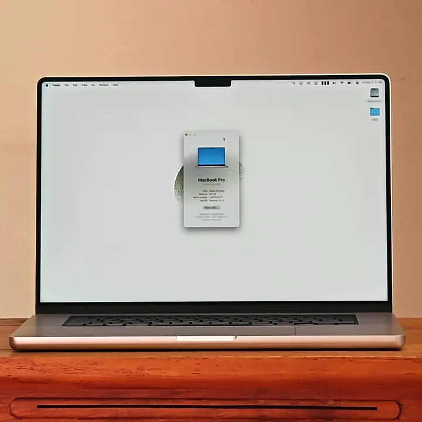

<h1 align="center">OmacVM</h1>

<h3 align="center">Omarchy in a VM on your Mac, feeling native</h3>

<p align="center">One command builds the VM, in Parallels Desktop or UTM. Then your Mac's Wi-Fi, sound, keys, trackpad, displays, Night Shift and wallpaper all work in Omarchy.</p>

<p align="center">
  <b>Pairs with <a href="https://github.com/gillesgoetsch/omanotch">Omanotch</a></b>: Omarchy's real bar beside the MacBook's notch, where the VM leaves a black strip.
</p>

<p align="center">
  
</p>

You run [Omarchy](https://omarchy.org) on an Apple Silicon Mac, in a VM. It is
fast, but out of the box it feels like a guest:

- **Full screen wastes the notch.** The VM sits below the camera housing and
  leaves a black strip across the top of your MacBook's screen.
- **The trackpad doesn't swipe.** Three- and four-finger swipes and pinch go to
  macOS's Mission Control and Spaces, never to Omarchy's workspaces.
- **Scrolling doesn't feel like a Mac.** The VM app turns your trackpad into a
  wheel; macOS's acceleration and momentum get lost on the way.
- **The bar shows a virtual network card**, not your Wi-Fi, and none of the
  Mac's audio devices.
- **The Mac's keys aren't Omarchy's.** Volume and brightness open macOS's
  popups, Cmd+Space opens Spotlight, and Parallels turns Cmd+C/V into Ctrl.
- **External displays ignore your macOS arrangement.**

**OmacVM** fixes all of that and builds the VM for you: Arch Linux ARM,
[omarchy-mac](https://github.com/omacom/omarchy-mac) and the glue on both sides
of the VM, with [Omanotch](https://github.com/gillesgoetsch/omanotch) putting
Omarchy's bar beside the notch.

> [!NOTE]
> **Got an M1 or M2 Mac?** You can run Omarchy natively on
> [Asahi Linux](https://asahilinux.org) instead. OmacVM is for **M3, M4 and
> newer** Macs, which Asahi does not support yet (and for anyone who wants macOS
> and Omarchy side by side).

## Get started

```bash
curl -fsSL https://raw.githubusercontent.com/gillesgoetsch/omacvm/main/install.sh | bash
```

This puts OmacVM in `~/.omacvm`, adds the `omacvm` command and starts it. Run
`omacvm` any time after that: with no VM yet it builds one; otherwise it asks
what you want to do (build another VM, switch features, update, check).

Prefer git? `git clone https://github.com/gillesgoetsch/omacvm && cd omacvm && ./install.sh`
(or just `./omacvm`).

Setting it up with a coding agent (Claude Code, Codex, …)? See
[With a coding agent](#with-a-coding-agent).

## What you get

<p align="center">
  
</p>

| | |
|---|---|
| **The bar beside the notch** | With [Omanotch](https://github.com/gillesgoetsch/omanotch), Omarchy's real bar moves into the black strip beside the MacBook's notch, and your windows get the full height of the screen |
| **Trackpad gestures** | Three- and four-finger swipes switch workspaces and pinch zooms while the VM is full screen; macOS's own Spaces swipe is off meanwhile. ⌃⌥⌘Esc hands the trackpad back to macOS |
| **Glide** *(experimental, but awesome)* | macOS-native scrolling, passed through: two-finger scrolling in every direction with your Mac's own acceleration and momentum, pinch included. Off unless you choose it ([how it works](#glide-macos-native-scrolling-passed-through)) |
| **The Mac's Wi-Fi in the bar** | Real network name and signal, nearby networks, and Omarchy's QR card to share the password (macOS asks you first) |
| **The Mac's audio in the bar** | Volume, mute, microphone, switching outputs (AirPods show up when they connect), with Omarchy's input meter |
| **Media keys, Omarchy's popup** | Volume, mute and brightness keys drive the Mac and Omarchy shows its own on-screen display instead of macOS's |
| **Displays that follow the Mac** | Native Retina resolution and 120 Hz ProMotion. On Parallels also every external display, in exactly the arrangement you set in macOS, with Omarchy's scaling menu kept |
| **Per-display workspaces** | Each display has its own workspaces 1…0, like Spaces. Unplug and they park on the Mac's screen; plug back in and they return |
| **Clipboard both ways, Cmd+V** | Copy in Omarchy, paste on the Mac and back; Cmd+V pastes everywhere, terminals included |
| **Night Shift** | Omarchy's nightlight toggle (Super+Ctrl+N, or Omarchy's menu) switches the Mac's Night Shift for the whole screen; strength and True Tone from the terminal (`omacvm-bridge night-shift strength 60`, `omacvm-bridge true-tone on`) |
| **Wallpaper follows the theme** | Switch Omarchy's theme or background and the Mac's desktop wallpaper follows, on every Space (macOS also shows it behind its own lock screen) |
| **Your keyboard layout** | Taken from the Mac |
| **Fast** | Near-native speed on Parallels; memory tuning so the VM does not hoard the Mac's RAM; btrfs snapshots you can boot from GRUB; optionally a memory-optimized kernel (transparent huge pages, MGLRU) |

<p align="center">
  
</p>

<p align="center">
  
</p>

## Two routes: Parallels or UTM

**Parallels Desktop is the recommended route**: Omarchy runs at native speed,
on every display. **UTM is free** and gets almost everything else.

| | Parallels Desktop | UTM |
|---|---|---|
| **Speed: Speedometer 3.1, Chrome** (Mac native: 46.3) | **46.1**, native (Pro, 16 vCPUs) | **36.7** headless, about **30** on the desktop |
| Why | | UTM's QEMU emulates the interrupt controller in software, so waking a thread on another CPU costs about twice as long (47 µs vs 25 µs) |
| Displays | every display, in the macOS arrangement, native Retina, 120 Hz, follows window and display changes live | one display, native Retina, 120 Hz, fixed from boot (UTM's GPU path goes blank on live mode changes) |
| CPUs and memory per VM | **Standard: 4 CPUs / 8 GB.** Pro (and the trial): up to 18 CPUs / 128 GB | no limit |
| Per-display workspaces | ✓ | (one display) |
| Wi-Fi, audio, media keys, Night Shift, True Tone, Wi-Fi QR (OmacVM Bridge) | ✓ | ✓ |
| Trackpad gestures (OmacVM Gestures) | ✓ | ✓ |
| **Glide**: macOS-native scrolling *(experimental)* | ✓ tuned and tested here | ✓ same code, less tested |
| Bar beside the notch ([Omanotch](https://github.com/gillesgoetsch/omanotch)) | ✓ | ✓ |
| Wallpaper follows the Omarchy theme | ✓ | ✓ |
| Clipboard both ways | ✓ (Parallels Tools + OmacVM's VM → Mac helper) | ✓ (UTM's SPICE daemon + OmacVM's Wayland agent) |
| Memory tuning, snapshots in GRUB, keyboard, Cmd+V, optional memory-optimized kernel | ✓ | ✓ |
| OmacVM icon for the VM | ✓ (Dock) | ✓ (UTM's library) |
| Cost | paid: Standard works; **Pro** for more than 4 CPUs / 8 GB | free; needs **UTM 5 (beta)**: `brew install --cask utm@beta` |

## Requirements

- An Apple Silicon Mac with macOS 14 or newer.
- [Parallels Desktop](https://www.parallels.com) 19 or newer: Standard gives a VM
  at most 4 CPUs and 8 GB, Pro (or the trial) up to 18 CPUs and 128 GB. Or
  **UTM 5**, which is still a beta (tested with 5.0.6):

  ```bash
  brew install --cask utm@beta
  ```

  or UTM.dmg from the newest "Beta" release on
  [UTM's GitHub](https://github.com/utmapp/UTM/releases). UTM's website, the
  App Store and `brew install --cask utm` all give UTM 4.7, which does not
  work here: its GPU acceleration leaves Linux apps as black windows, and only
  software rendering works
  ([omarchy-arm-utm#7](https://github.com/ggalancs/omarchy-arm-utm/issues/7)).
  Already have 4.7 from Homebrew? `brew uninstall --cask utm && brew install --cask utm@beta`
  (your VMs stay). OmacVM uses UTM 5's OpenGL path (VirGL), which renders
  Linux desktops, unlike its new Vulkan one.
- Xcode Command Line Tools (`xcode-select --install`), [Homebrew](https://brew.sh)
  and its `zstd` and `e2fsprogs` (`brew install zstd e2fsprogs`).
- About 60 GB of free disk space and a decent connection.

`omacvm` tells you about anything missing before it starts and waits while you
install Parallels or UTM.

## Build a VM

```bash
omacvm            # or: omacvm build
```

<p align="center">
  
</p>

It asks a few questions before it builds anything:

1. **Parallels or UTM**, with the comparison above. If the app isn't
   installed yet (or UTM is older than 5), it says how to get the right
   version and waits.
2. **How much of the Mac the VM gets**: Low, Balanced, High or Best (arrow
   keys), shown as CPUs and memory; every value can be changed. Best leaves
   macOS and the GPU a buffer of a quarter of the memory, at least 8 GB.
   Parallels Standard allows 4 CPUs and 8 GB, and OmacVM stays within that.
3. **The recommended settings**, which you can take as they are or go
   through one by one:

   | | Default |
   |---|---|
   | OmacVM Bridge: the Mac's Wi-Fi, audio, Night Shift and media keys in Omarchy | on |
   | Omarchy's wallpaper on the Mac too | on |
   | Trackpad gestures in Omarchy (macOS's own swipes off in full screen, ⌃⌥⌘ Esc gives them back) | on |
   | Omanotch, on a MacBook with a notch | on |
   | Omarchy's own screensaver and lock after idle (off: the Mac's lock protects the VM) | kept |
   | Autologin | off |
   | Memory-optimized kernel: Arch Linux ARM's kernel rebuilt with transparent huge pages and MGLRU (its own has neither), for memory-heavy work; adds about 10 minutes to the build | off |

4. **Glide**, on its own: experimental, so you choose it (default off).
5. **Your user name, full name and password.** Omarchy's own first-boot setup
   is not used.

Then it shows a summary and starts: 30 to 70 minutes, mostly downloads and
Omarchy's install. A VM window opens on the way: that is the temporary
installer, leave it alone. `omacvm build --dry-run` asks everything and stops
at the summary; `omacvm build --help` lists the options for unattended builds.
Your keyboard layout, timezone and language come from the Mac.

When it is done, once on the Mac:

1. **Allow the prompts**: Location Services for *OmacVM Bridge* (Wi-Fi
   names), Accessibility for *OmacVM Bridge* and *OmacVM Gestures*,
   Input Monitoring for *OmacVM Gestures*.
2. **Parallels: let Cmd reach Omarchy.** Parallels' Linux keyboard profile turns
   Cmd+C/V/X into Ctrl before the VM sees them; the build empties it when no VM
   is running (otherwise: quit Parallels Desktop and run
   `src/mac/parallels-shortcuts.sh`). Then set *macOS System
   Shortcuts › Send macOS system shortcuts* to **Always**, so Cmd+Space and
   friends reach Omarchy. Parallels keeps this setting to itself, so OmacVM
   can't set it; the build shows a macOS alert with this guide until it is
   set (`src/mac/parallels-system-shortcuts.sh` brings it back), and
   `omacvm check` tells you whether both are done.

   <p align="center">
     
   </p>
3. **UTM:** keep UTM in the foreground app list (started from the Dock or
   Spotlight); UTM launched in the background runs the VM several times slower.

Put the VM in full screen for the trackpad gestures, Glide and the media keys.
While it is full screen and in front, the Mac's trackpad gestures and ⌘
shortcuts go to Omarchy, and macOS's own Spaces swipe is off. **⌃⌥⌘ Esc**
hands the trackpad back to macOS (Omarchy shows a notification), so you can
swipe to your other Spaces; coming back to the full-screen VM captures it
again. Volume and brightness keys always change the Mac, with Omarchy's popup
while you are in the VM.

<p align="center">
  
</p>

## Switch features, on any VM

```bash
omacvm features              # see them, switch them (↑/↓, space, Return)
omacvm enable glide          # or straight away
omacvm disable gestures --vm "Omarchy ARM"
```

Every feature above can be switched on or off later, one at a time, and the
VM keeps your choices across updates. OmacVM installs what a feature needs on
the Mac too, and switching one takes well under a minute (the memory-optimized kernel
takes about 10 minutes the first time). A feature that needs another brings
it along: Glide needs the trackpad gestures, the wallpaper needs the Bridge.

**Already have an Omarchy VM** you installed yourself from omarchy-mac?
`omacvm apply --vm NAME` adds OmacVM to it. If OmacVM cannot get in yet, it
prints the one command to run in the VM's terminal first (it lets OmacVM in
with its own SSH key, from the Mac only).

## Update

```bash
omacvm update
```

Pulls the newest OmacVM (when your copy has no local changes), updates the Mac
side and every running VM that has OmacVM, keeping each VM's choices. Stopped
VMs are listed; `omacvm update --vm NAME` starts one and updates it.

## Check

```bash
omacvm check            # --vm NAME for another VM
```

Goes through every feature on the Mac and in the running VM (permissions, the
Bridge, the bar widgets, gestures, Glide, clipboard and pointer, kernel,
memory, Omanotch) and prints `ok` / `FAIL` with what to do about each failure.
It only reads; nothing is changed. `omacvm vms` lists your VMs and their
OmacVM version.

## With a coding agent

OmacVM is built to be driven by an agent as well as by hand. Point yours at
this repository and ask, for example: *"Set up OmacVM on my Mac: a Parallels
VM with Glide on"* or *"Turn on Glide for my VM 'Omarchy'"*.

- [AGENTS.md](AGENTS.md) is the manual for agents: recipes for building,
  switching features, updating and fixing, plus everything that was tried and
  does not work. Claude Code also picks up the skill in
  [.claude/skills/omacvm](.claude/skills/omacvm/SKILL.md).
- Machine-readable: `omacvm vms --json`, `omacvm features --json`,
  `omacvm check --json`, `omacvm build --plan --json` (what would be built,
  the steps only you can do as `needs_human`, and the exact command).
- Nothing waits on a question without a terminal: `--yes` and options instead
  (`omacvm build --help`), the password from `OMACVM_PASSWORD`. Exit codes:
  0 done, 1 failed, 2 usage, 3 needs a person (installing Parallels or UTM, a
  macOS permission), and the message says what to do.

The steps that need you (macOS permission prompts, one Parallels setting, your
password) stay with you; the agent hands them over.

## How it works

<p align="center">
  
</p>

The VM and the Mac talk over the VM's private network: the Mac is `10.211.55.2`
for Parallels and `192.168.64.1` for UTM. Nothing listens anywhere else, and
the VM needs a token.

- **OmacVM Bridge** (`src/bridge/`) is a small menu-bar app. It reads the Mac's
  Wi-Fi (CoreWLAN), audio (CoreAudio) and display (brightness, Night Shift, True
  Tone) and pushes every change to the VM; Omarchy's bar widgets and popups
  listen. While the VM is full screen it takes the media keys. It also sets the
  wallpaper the VM sends. [API and details](src/bridge/README.md).
- **OmacVM Gestures** (`src/gestures/`) reads the trackpad's raw touches and
  replays multi-finger frames on a virtual Apple touchpad in the VM, where
  Hyprland turns them into real gestures. Each VM tells it what it wants, so a
  VM without gestures keeps macOS's own. Over the full-screen VM it also hides
  the Mac's pointer, so only Omarchy's shows.

<p align="center">
  
</p>

- **Displays** (`src/display/`, Parallels): Parallels tells the guest the size,
  refresh rate and position of every display, but Hyprland never applies it;
  `parallels-dynres` does. On UTM (`src/utm/`) the display mode is the Mac's
  built-in display below the notch, set from boot.
- **The memory-optimized kernel** (`src/kernel/`, opt-in) is Arch Linux ARM's own `linux-aarch64`, rebuilt
  with transparent huge pages always on and MGLRU; the stock kernel stays in
  GRUB as a fallback. **Memory** (`src/memory/`): the VM never hands back memory it
  touched while it runs, so the guest keeps a small zram and reclaims smoothly
  instead of hoarding.

<p align="center">
  
</p>

With two VMs running, the wallpaper follows whichever changed its theme last.

### Glide: macOS-native scrolling, passed through

Parallels and UTM give Linux a mouse wheel: your trackpad's two-finger
scrolling arrives as wheel steps, and the feel of macOS (acceleration,
momentum, precise slow scrolling) is gone. With Glide on, the full-screen
VM gets the real thing instead:

- **Your fingers**, as raw positions from the built-in trackpad, precise to
  hundredths of a millimetre, on a virtual Apple trackpad in the VM: slow
  scrolling follows them exactly;
- **macOS's own acceleration**, blended in as you speed up;
- **macOS's own momentum** after you lift, continued on the same virtual
  fingers, so apps add no fling of their own. Measured side by side with macOS,
  the glide after a flick lands within 5–10 % of macOS's distance, with the
  same decay;
- **pinch** whenever macOS recognizes one.

It is tuned against a MacBook Pro 16" and scales itself to yours: the
trackpad's size, your scrolling direction and speed setting, and Omarchy's
display scale. Chromium-based apps (Chrome, Slack, VS Code, …) scroll about 3×
further per movement than GTK apps, so they get their own factor.

It is **experimental**: tuned on one Mac, by feel and by measurement, over 29
rounds. The whole story, with every measurement and the analysis scripts, is in
[docs/experiments/trackpad-scrolling.md](docs/experiments/trackpad-scrolling.md).
Try it with `omacvm enable glide`, go back with `omacvm disable glide`.

The whole build, every VM setting and the dead ends we hit are in
[AGENTS.md](AGENTS.md).

## How fast

Measured on a MacBook Pro M4 Max: Parallels Desktop Pro (trial) with 16 vCPUs and the memory-optimized kernel, UTM 5.0.6:

| | Mac (macOS) | Parallels | UTM |
|---|---|---|---|
| Geekbench 7 multi-core | 26999 | 27201 | 24230 |
| Geekbench 7 single-core | 3286 | 3270 | 3020 |
| Speedometer 3.1, Chrome, headless | 46.3 | 46.1 | 36.7 |
| Speedometer 3.1, Chrome on the desktop | | 42.7 | 29.5–31.6 |
| Random reads over 1 GiB | 0.186 s | 0.22 s | |
| Cross-CPU thread wake-up | | 24.8 µs | 46.6 µs |

UTM's Speedometer numbers are with OmacVM's UTM setting (UTM's Vulkan driver
off); out of the box UTM scored 24.8. Its Geekbench run was on an earlier
Omarchy VM with the same 16 vCPUs.

## With Omanotch: the bar beside the notch

On a notched MacBook, the full-screen VM sits *below* the camera housing and
leaves a black strip across the top. **[Omanotch](https://github.com/gillesgoetsch/omanotch)**
streams Omarchy's real bar into that strip and gives the space back to your
windows; the graphics on this page show the two together. It is a separate
project for Parallels and UTM; OmacVM sets it up as a feature on a MacBook
with a notch (`omacvm enable omanotch` on an existing VM).

## Troubleshooting

- **First stop**: `omacvm check` names what is wrong and what to do.
- **The Mac's pointer shows over the full-screen VM**: menu bar tools that keep
  their own window across the top of the screen (Bartender, for one) can bring
  it back. Quit them while you work in the VM.
- **Gestures or Glide do nothing**: the VM must be full screen and in front;
  ⌃⌥⌘ Esc may have handed the trackpad to macOS (press it again). Check the
  Accessibility and Input Monitoring permissions of *OmacVM Gestures*.
- **Glide feels too fast or slow in one app**: Chromium-based apps get their
  own factor; tell us the app (window class from `hyprctl clients`) in an
  issue. Glide's settings are in `src/gestures/guest/omacvm-gestures`
  (`OMACVM_GLIDE_*`).

## Uninstall

```bash
omacvm uninstall            # --purge also removes the bridge token and settings
```

Then delete the VM in Parallels Desktop or UTM. In System Settings › Privacy &
Security, remove the OmacVM apps from Location Services if still listed.

## Credits

[Omarchy](https://omarchy.org) (MIT), [omarchy-mac](https://github.com/omacom/omarchy-mac)
and [try-omarchy](https://github.com/omacom/try-omarchy) by the Omarchy team,
[Arch Linux ARM](https://archlinuxarm.org),
[omarchy-parallels](https://github.com/vincenzopalazzo/omarchy-parallels) by
Vincenzo Palazzo (MIT), whose image builder is the temporary installer here, and
[omarchy-arm-utm](https://github.com/ggalancs/omarchy-arm-utm), whose UTM
findings (virtio-gpu settings, UTM's scripting) shaped the UTM route and
whose Wayland SPICE agent (MIT) OmacVM's `omacvm-vdagent` is based on. The bar
widgets are clones of Omarchy's own. OmacVM is a community project, not
affiliated with the Omarchy team, Parallels, UTM or Apple.

## License

MIT, see [LICENSE](LICENSE).
