<h1 align="center">Omaparallels</h1>

<h3 align="center">Omarchy in Parallels Desktop, feeling like a native Mac</h3>

<p align="center">One command builds it. Then your Mac's Wi-Fi, sound, keys, trackpad, displays and lock screen all just work in Omarchy.</p>

<p align="center">
  <b>Pairs with <a href="https://github.com/gillesgoetsch/omanotch">Omanotch</a></b>: Omarchy's real bar beside the MacBook's notch, where Parallels leaves a black strip.
</p>

<p align="center">
  
</p>

You run [Omarchy](https://omarchy.org) on an Apple Silicon Mac, in Parallels
Desktop. It is fast, but out of the box it feels like a guest: the bar shows a
virtual Ethernet card, the volume keys open macOS's popup, the trackpad can't
swipe between workspaces, the resolution is wrong after every change, an
external display goes wherever it wants, copy and paste only works one way.

**Omaparallels** fixes all of that, and builds the VM for you: Arch Linux ARM,
[omarchy-mac](https://github.com/omacom/omarchy-mac), Parallels Tools, a
tuned kernel, and the glue on both sides.

> [!NOTE]
> **Got an M1 or M2 Mac?** You can run Omarchy natively on
> [Asahi Linux](https://asahilinux.org) instead. Omaparallels is for **M3, M4 and
> newer** Macs, which Asahi does not support yet (and for anyone who wants macOS
> and Omarchy side by side).

## What you get

| | |
|---|---|
| **Displays that follow the Mac** | Native Retina resolution, 120 Hz ProMotion, every external display, and the VM's monitors in exactly the arrangement you set in macOS. Omarchy's scaling menu is kept |
| **Per-display workspaces** | Each display has its own workspaces 1…0, like Spaces. Unplug and the workspaces park on the Mac's screen; plug back in and they return |
| **Trackpad gestures** | Three- and four-finger swipes switch workspaces, pinch zooms, while the VM is full screen. ⌃⌥⌘Esc hands them back to macOS |
| **Smooth scrolling** | Pixel-precise, with macOS's inertia |
| **The Mac's Wi-Fi in the bar** | Real SSID and signal, nearby networks, and a QR code to share the password |
| **The Mac's audio in the bar** | Volume, mute, microphone, switching outputs (AirPods show up when they connect), with Omarchy's input meter |
| **Media keys, Omarchy's popup** | Volume, mute and brightness keys work on the Mac and show Omarchy's own on-screen display instead of macOS's |
| **Night Shift and True Tone** | Omarchy's nightlight toggle (Super+Ctrl+N) switches the Mac's Night Shift; strength and True Tone in the monitor settings |
| **Clipboard both ways, Cmd+V** | Copy in Omarchy, paste on the Mac and back; Cmd+V pastes everywhere, terminals included |
| **Your keyboard layout** | Taken from the Mac |
| **The lock screen follows the theme** | Switch Omarchy's theme and the Mac's wallpaper and lock screen follow, drawn like Omarchy's lock |
| **An Omarchy Dock icon** | For the VM, rendered from Omarchy's own mark |
| **The bar beside the notch** | With [Omanotch](https://github.com/gillesgoetsch/omanotch), Omarchy's bar moves into the strip beside the MacBook's notch |
| **Fast** | A THP + MGLRU kernel built from Arch Linux ARM's own, memory tuning so the VM doesn't hoard the Mac's RAM, btrfs snapshots you can boot from GRUB |

<p align="center">
  
</p>

## Requirements

- An Apple Silicon Mac with macOS 14 or newer.
- [Parallels Desktop](https://www.parallels.com) 19 or newer. **Standard is
  enough**: Omaparallels writes the VM's settings itself and needs no Pro-only
  command-line tools.
- Xcode Command Line Tools (`xcode-select --install`) and Homebrew's `zstd` and
  `e2fsprogs` (`brew install zstd e2fsprogs`).
- About 60 GB of free disk space and a decent connection.

## Build

```bash
git clone https://github.com/gillesgoetsch/omaparallels && cd omaparallels
./build.sh
```

<p align="center">
  
</p>

`build.sh` reads your login name, keyboard layout, timezone and language from
the Mac, suggests CPUs, memory and disk from what the Mac has, shows it all,
and asks for the password of your user in the VM. Then it takes about an hour,
mostly downloads, Omarchy's install and the kernel build. A Parallels window
opens on the way: that is the temporary installer, leave it alone. Options:
`./build.sh --help` (VM name, CPUs, memory, disk, `--autologin`,
`--no-thp-kernel`, `--omanotch`, …).

When it is done, once on the Mac:

1. **Allow the prompts**: Location Services for *Omaparallels Bridge* (Wi-Fi
   names), Accessibility for *Omaparallels Bridge* and *Omaparallels Gestures*,
   Input Monitoring for *Omaparallels Gestures*.
2. **Let Cmd reach Omarchy**: Parallels' Linux keyboard profile turns Cmd+C/V/X
   into Ctrl before the VM sees them. Quit Parallels Desktop and run
   `mac/parallels-shortcuts.sh` (or remove the mappings in Parallels Desktop ›
   Settings › Shortcuts › Virtual Machines › Linux). Then also set *macOS System
   Shortcuts › Send macOS system shortcuts* to **Always**, so Cmd+Space and
   friends reach Omarchy.
3. Optional: System Settings › Screen Saver › **Omarchy Lock**, and Lock Screen ›
   require password immediately.

Put the VM in full screen (⌃⌘F) for the trackpad gestures and media keys.

## Update

```bash
git pull
mac/install.sh
./apply.sh --vm Omarchy          # --no-thp-kernel skips the kernel rebuild
```

`apply.sh` brings any running VM up to the current Omaparallels, including one
you built by hand from omarchy-mac.

## How it works

<p align="center">
  
</p>

The VM and the Mac talk over Parallels' private network (the Mac is
`10.211.55.2`), nothing listens anywhere else.

- **Omaparallels Bridge** (`bridge/`) is a small menu-bar app. It reads the
  Mac's Wi-Fi (CoreWLAN), audio (CoreAudio) and display (brightness, Night
  Shift, True Tone) and pushes every change to the VM as events; Omarchy's bar
  widgets and popups listen. While the VM is full screen it takes the media
  keys. [API and details](bridge/README.md).
- **Omaparallels Gestures** (`gestures/`) reads the trackpad's raw touches and
  replays multi-finger frames on a virtual Apple touchpad in the VM, where
  Hyprland turns them into real gestures.

<p align="center">
  
</p>

- **Displays** (`display/`): Parallels tells the guest the size, refresh rate
  and position of every display, but Hyprland never applies it.
  `parallels-dynres` reads what Parallels pushes and applies exactly that.
- **Clipboard** (`clipboard/`), **lock screen** (`lock/`) and the display
  layout use Parallels shared folders.
- **The kernel** (`kernel/`) is Arch Linux ARM's own `linux-aarch64`, rebuilt
  with transparent huge pages always on and MGLRU; the stock kernel stays in
  GRUB as a fallback. **Memory** (`memory/`): Parallels never takes back memory
  the guest touched while it runs, so the guest keeps a small zram and reclaims
  smoothly instead of hoarding.

<p align="center">
  
</p>

The whole build, every Parallels setting and the dead ends we hit are in
[AGENTS.md](AGENTS.md), written so a coding agent can build and maintain the
setup on its own.

## How fast

Measured on a MacBook Pro M4 Max, VM with 16 vCPUs, the THP kernel:

| | Mac (macOS) | Omarchy VM |
|---|---|---|
| Geekbench multi-core | 26999 | 27201 |
| Geekbench single-core | 3286 | 3270 |
| Speedometer 3.1, Google Chrome | 46.3 | 46.1 |
| Random reads over 1 GiB | 0.186 s | 0.22 s |

Chrome renders on the GPU in the VM (virgl).

## With Omanotch: the bar beside the notch

On a notched MacBook, Parallels puts the full-screen VM *below* the camera
housing and leaves a black strip across the top. **[Omanotch](https://github.com/gillesgoetsch/omanotch)**
streams Omarchy's real bar into that strip and gives the space back to your
windows: the graphics on this page show the two together. It is a separate
project (it also works with UTM and without Omaparallels);
`./build.sh --omanotch` sets it up as part of the build.

## Uninstall

```bash
mac/uninstall.sh            # --purge also removes the bridge token and settings
```

Then delete the VM in Parallels Desktop. In System Settings › Privacy &
Security, remove the Omaparallels apps from Location Services if still listed.

## Credits

[Omarchy](https://omarchy.org) (MIT), [omarchy-mac](https://github.com/omacom/omarchy-mac)
and [try-omarchy](https://github.com/omacom/try-omarchy) by the Omarchy team,
[Arch Linux ARM](https://archlinuxarm.org), and
[omarchy-parallels](https://github.com/vincenzopalazzo/omarchy-parallels) by
Vincenzo Palazzo (MIT), whose image builder is the temporary installer here.
The bar widgets are clones of Omarchy's own. Omaparallels is not affiliated
with Parallels or Apple; Parallels Desktop is their commercial product.

## License

MIT, see [LICENSE](LICENSE).
